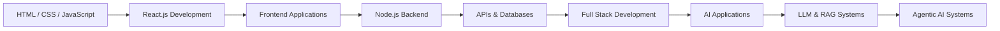

<!-- ================= HEADER ================= -->

<p align="center">

</p>


<!-- ================= TYPING ANIMATION ================= -->

<h1 align="center">


</h1>


<p align="center">


</p>


---

# 👩‍💻 About Me


Hi 👋 I'm **Sadaf Kareem**

🎓 Software Engineering Student  
🌐 Full Stack Developer  
🤖 Agentic AI Developer  


I am passionate about technology, software development, and Artificial Intelligence.


I enjoy building applications, exploring new concepts, and learning how modern technologies can create impactful solutions.


Currently focusing on:

- 🌐 Full Stack Development
- 🤖 Agentic AI Systems
- 🧠 LLM Applications
- 🔗 RAG Technologies
- ⚡ AI Automation


---

# 🛠️ Technologies I Work With


<p align="center">


</p>


---

# 🤖 AI Interests


- 🤖 Agentic AI
- 🧠 Large Language Models
- 🔗 Retrieval Augmented Generation (RAG)
- 💬 Prompt Engineering
- ⚡ AI Automation
- 🚀 Intelligent Applications


---

# 📚 Currently Learning


```
🌐 Advanced Full Stack Development

🤖 Agentic AI Engineering

🧠 LLM Applications

⚙️ Backend Development

🏗️ Software Engineering Practices
```


---

# 🚀 Development Journey





---

# 🎯 Goals


🚀 Become an AI-focused Full Stack Developer  

🤖 Build intelligent AI applications  

🌍 Contribute to innovative technology projects  

📚 Keep learning and improving every day  


---

# 📊 GitHub Stats


<p align="center">


</p>


<p align="center">


</p>


<p align="center">


</p>


---

# 🌐 Connect With Me


<p align="center">

<a href="YOUR_LINKEDIN_URL">

</a>


<a href="mailto:sadafkareem@gmail.com">

</a>


<a href="https://github.com/Sadaf032">

</a>

</p>


---

# 💡 Developer Philosophy


<p align="center">

<i>
"Building intelligent solutions by combining creativity, code, and artificial intelligence."
</i>

</p>


---

<p align="center">

⭐ Thanks for visiting my profile

</p>


<!-- ================= FOOTER ================= -->

<p align="center">


</p>
